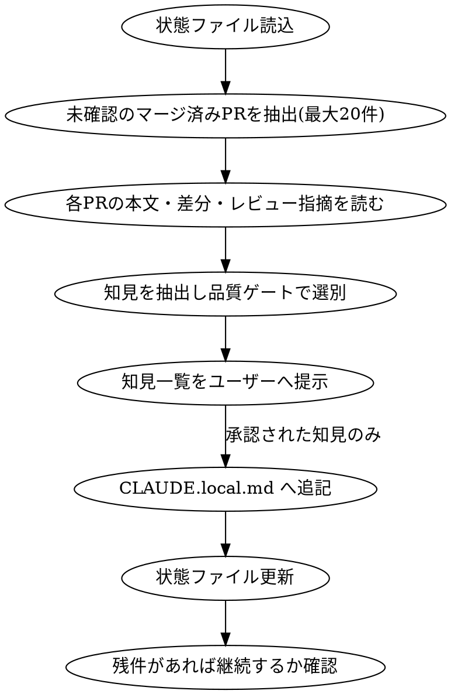

# GitHub PR Knowledge

## Overview

対象リポジトリの**未確認のマージ済みPR**を走査し、PR本文・差分・レビュー指摘コメントから
**今後のローカル開発に活かせる知見**を抽出して `CLAUDE.local.md` へ蓄積する。

処理済みPR番号は `.claude/pr-knowledge-state.json` に記録し、次回以降は差分だけを処理する。
保存先・状態ファイルともにGit管理外（`~/dotfiles/.gitignore_global` に登録済み）で、**個人の学習履歴**として扱う。

`github-pr-review`（レビューする）/ `github-pr-respond`（指摘に対応する）と対になる、**PRから学ぶ**スキル。

## When to Use

- 「PRから知見を集めて」「マージ済みPRの学びをストックして」等の依頼
- 新しいリポジトリに参加した直後、過去のPRから暗黙のルールを吸い上げたいとき
- 対象は基本カレントディレクトリのgitリポジトリ。ユーザーが別リポジトリ（owner/repo）を明示した場合はそちらを使う

## Prerequisites

- `gh auth status` で認証済みであること。未認証なら案内して中断する
- カレントディレクトリが対象リポジトリのgit作業ツリーであること

## Workflow



---

### 1. 状態ファイルの読込

`<リポジトリルート>/.claude/pr-knowledge-state.json` を読む。無ければ処理済み0件として扱う。

```json
{
  "repo": "your-org/your-repo",
  "processed_prs": [412, 430, 455],
  "last_run": "2026-08-15"
}
```

- **Git管理外**（`~/dotfiles/.gitignore_global` の `**/.claude/pr-knowledge-state.json` で除外済み）
- `processed_prs` は「読んで判断した」PR番号。**知見を採用しなかったPRも記録する**（再読込を避けるため）

### 2. 未確認のマージ済みPRの抽出

**マージ済み（merged）のPRのみを対象**とする。`open` や 単に `closed`（マージされていない）は対象外。
作成者は限定せず、リポジトリ内の全マージ済みPRを対象とする。

```bash
gh pr list --repo <owner>/<repo> --state merged --limit 100 \
  --json number,title,author,mergedAt,url \
  --jq 'sort_by(.number) | reverse'
```

`processed_prs` に含まれないものが未確認PR。**新しい順に最大20件**を今回の処理対象とする。

- 未確認が20件を超える場合は、その旨を伝え、この回では20件のみ処理する（手順7で継続を確認する）
- 未確認が0件なら「新しく確認するPRはありません」と伝えて終了する

### 3. 各PRの読み込み

対象PRごとに以下を取得する。**差分が巨大な場合はファイル一覧と要点に絞り、全文を無理に読み込まない。**

```bash
# PR本文・メタ情報
gh pr view <number> --repo <owner>/<repo> --json title,body,files,additions,deletions

# レビュー指摘コメント（インライン）
gh api "repos/<owner>/<repo>/pulls/<number>/comments?per_page=100" \
  -q '.[] | {path, line, user: .user.login, body}'

# レビューサマリー・議論コメント
gh api "repos/<owner>/<repo>/pulls/<number>/reviews" -q '.[] | {user: .user.login, state, body}'
gh api "repos/<owner>/<repo>/issues/<number>/comments" -q '.[] | {user: .user.login, body}'

# 差分（必要な範囲のみ）
gh pr diff <number> --repo <owner>/<repo>
```

**知見の宝庫は「レビュー指摘」と「その返信」。** 特に以下に注目する。

- 指摘 → 修正されたもの（＝チームが是とする書き方）
- 指摘 → 見送られたもの（＝そのプロジェクト固有の事情・トレードオフ）
- 同じ趣旨の指摘が複数PRで繰り返されているもの（＝暗黙のルール。最も価値が高い）
- レビューでの議論（設計判断の理由・却下された代替案）

### 4. 知見の抽出と品質ゲート

抽出した各知見に対し、以下を**順に**判定する。**1つでも「いいえ」なら採用しない。**

1. **再現性があるか** — 今後の別のタスクでも役立つか（このPR限りの事情ではないか）
2. **コードから自明でないか** — コードや型定義を読めば30秒で分かることではないか
3. **既存ルールと重複しないか** — `CLAUDE.md` / `.claude/rules/*.md` / 既存の `CLAUDE.local.md` に同じ内容が既にないか
4. **事実に基づくか** — PRの記述・差分・レビューコメントという根拠があるか（推測で書かない）

**採用しないもの（アンチパターン）:**

- PRの変更内容の要約・時系列の説明（それはgitログの仕事）
- 「〇〇機能を追加した」という事実だけの記録
- 一般論（「テストを書きましょう」等、このプロジェクト固有でないもの）
- レビュアーの好みが分かれている、結論の出ていない議論
- 憶測・「〜かもしれない」という不確かな内容

**採用する知見の型:**

| 型 | 内容 | 例 |
|---|---|---|
| 落とし穴 | 踏むと壊れる罠、エラー→原因→対処 | 「本番とバックテストで指標の計算窓幅を揃えないと成績が再現しない」 |
| 暗黙のルール | 明文化されていないがレビューで必ず指摘される慣習 | 「Repositoryの一覧取得メソッドには必ず `with()` を書く（N+1指摘が頻出）」 |
| 設計判断 | なぜその形になっているか（却下された代替案含む） | 「Dockerfile.ecs は未使用。触ると本番構成と乖離する」 |
| 手順・コマンド | 非自明な操作方法 | 「テストは `make test branch` で差分のみ実行できる」 |
| プロジェクト固有の制約 | 外部システム・運用上の縛り | 「1h足のcandlesが未同期だとシグナル生成が全停止する」 |

### 5. ユーザーへ提示（確認）

**書き込む前に必ず承認を得る。** 抽出した知見を一覧提示し、AskUserQuestionで採否を確認する。

知見が多い場合は「すべて採用 / 個別に選ぶ / すべて破棄」の選択肢を出し、「個別に選ぶ」が選ばれたら番号で指定させる。

```
処理対象: 未確認のマージ済みPR 20件（残り 34件）

## 抽出した知見（5件）

1. [落とし穴] 指標の計算窓幅は本番・バックテスト・フロントで揃える
   本番100本/バックテスト42本/フロント72本と窓幅が食い違い、Wilder平滑化の
   回数差で値がズレた。同じ指標を複数層で計算する際は窓幅を定数で共有する。
   出典: PR #455

2. [暗黙のルール] Repositoryの一覧取得はリレーションを必ず eager load する
   PR #412 / #455 で同じN+1指摘。`.claude/rules/database.md` に明記はあるが、
   新規メソッド追加時に見落としやすい。
   出典: PR #412, #455

3. [設計判断] docker/app/Dockerfile.ecs は編集しない
   過去のAWS ECS運用時の名残で現在未使用。PR #430 で修正が入りかけたが差し戻された。
   出典: PR #430

...

これらを CLAUDE.local.md へ追記しますか。
```

- **出典（PR番号）を必ず添える。** 後から経緯を辿れるようにする
- 複数PRで繰り返し現れた知見は、出典を並記して「繰り返し指摘されている」ことを示す

### 6. CLAUDE.local.md への追記

`<リポジトリルート>/CLAUDE.local.md` へ追記する。無ければ新規作成する。

- **Git管理外**（`~/dotfiles/.gitignore_global` の `CLAUDE.local.md` で除外済み）
- **既存の記述を勝手に消さない。** 同じ主題の項目が既にある場合は、新規追加ではなく**その項目を更新・統合**する
- 1項目1原則。冗長な経緯説明は書かず、原則と根拠だけ残す

```markdown
# CLAUDE.local.md

このファイルは個人用の開発メモです（Git管理外）。
`github-pr-knowledge` スキルがマージ済みPRから抽出した知見を蓄積しています。

## PRから学んだ知見

### 落とし穴

- **同じ指標を複数層で計算する場合、計算窓幅を必ず揃える**
  Wilder平滑化（RSI/ADX）は入力本数で値が変わる。本番100本・バックテスト42本・
  フロント72本で食い違い、バックテスト成績が本番で再現しなかった。
  窓幅は定数で共有する。（PR #455）

### 暗黙のルール

- **Repositoryの一覧取得メソッドはリレーションを eager load する**
  `with()` の付け忘れによるN+1指摘が繰り返し発生している。（PR #412, #455）

### 設計判断

- **`docker/app/Dockerfile.ecs` は編集しない**
  過去のAWS ECS運用時の名残で現在未使用。（PR #430）
```

**ファイルが肥大化してきたら整理する**（目安: 1セクション15項目超、または全体400行超）。

- 同じ根本原因の項目は1つにまとめ、症状を並記する
- 既にコードや `.claude/rules/*.md` へ反映され、再導出が容易になった項目は削除する
- 参照している機能・ファイルが消えた項目は削除する

### 7. 状態ファイルの更新と継続確認

処理したPR番号を `processed_prs` へ追加し、`last_run` を更新して保存する。
**知見を採用しなかったPRも記録する**（再度読み込まないため）。

未確認PRが残っている場合、残件数を伝えて「続けて次の20件を処理するか」をAskUserQuestionで確認する。
「はい」なら手順2へ戻る。「いいえ」なら完了報告して終了する。

### 8. 完了報告

- 今回処理したPR件数 / 採用した知見の件数
- `CLAUDE.local.md` へ追記した項目の見出し
- 未確認PRの残件数
- **チーム共有すべき知見があれば、その旨を提案する**（`CLAUDE.local.md` は個人用のため、
  チーム全体に効く知見は `.claude/rules/*.md` への反映をユーザーへ提案する。勝手には書かない）

---

## Common Mistakes

- `open` や未マージの `closed` PRを対象にする → **マージ済みのみ**。議論中・却下された指摘をルール化しない
- 差分の要約をそのまま知見として書く → それはgitログの仕事。**原則・教訓だけ**を残す
- 一般論（「テストを書く」「命名を分かりやすく」）を書く → **このプロジェクト固有**の知見のみ
- 出典のPR番号を書かない → 後から経緯を辿れなくなる
- ユーザーの承認なしに `CLAUDE.local.md` を書き換える → 書き込み前に必ず一覧提示して確認する
- 既存の記述を消して上書きする → 追記または統合。既存項目は勝手に消さない
- 知見を採用しなかったPRを `processed_prs` に記録し忘れる → 毎回同じPRを読み直すことになる
- `CLAUDE.local.md` や状態ファイルをコミットしようとする → 両方ともGit管理外
- 巨大PRの差分を全文読み込む → ファイル一覧とレビュー指摘を優先し、必要な箇所だけ読む
- チーム全体に効く知見を個人ファイルに埋もれさせる → `.claude/rules/*.md` への反映を提案する（提案のみ。勝手に書かない）
