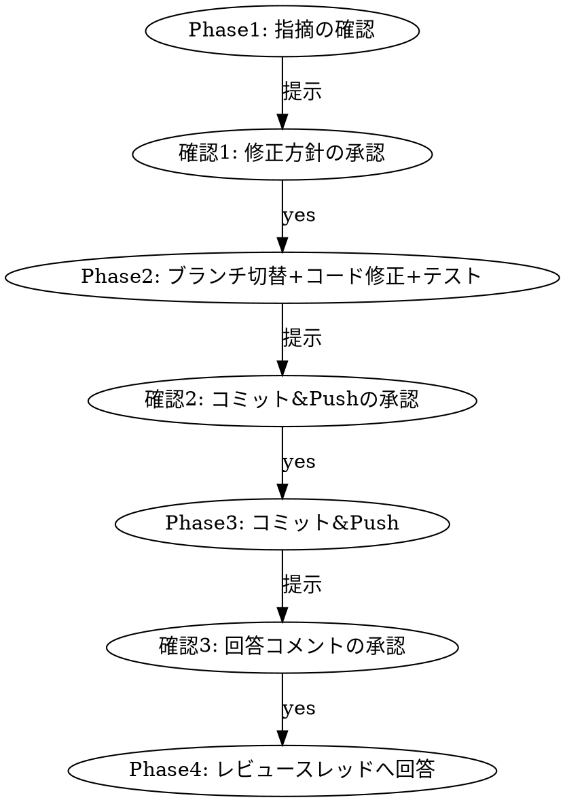

# GitHub PR Respond

## Overview

指定したPRの未対応レビュー指摘を確認し、ローカルで修正 → テスト → コミット＆Push → 各レビュースレッドへ回答する。
**4つのフェーズに分かれており、各フェーズの開始前に必ずユーザーの承認を得る。**

`github-pr-review` スキル（レビューする側）と対になる、レビューを受ける側のスキル。

## When to Use

- 「PRのレビュー指摘に対応して」「指摘を直してpushして」等の依頼
- 対象は基本カレントディレクトリのgitリポジトリ。ユーザーが別リポジトリ（owner/repo）やPR URLを明示した場合はそちらを使う

## Prerequisites

- `gh auth status` で認証済みであること。未認証なら案内して中断する
- カレントディレクトリが対象リポジトリのgit作業ツリーであること（**一時cloneはしない**。Docker等のテスト環境をそのまま使うため）

## Phase Gate（最重要）

以下の4フェーズを順に実行する。**各フェーズの作業を始める前に、AskUserQuestionでユーザーの承認を得る。**
承認なしに次フェーズへ進まない。ユーザーが「いいえ」を選んだ場合はその時点で終了する。



---

## Phase 1: 指摘の確認

**このフェーズは読み取りのみ。コードもブランチも変更しない。**

### 1-1. リポジトリとPRの特定

- PR URL 指定あり → URLから `owner/repo` とPR番号を解決
- PR番号のみ指定 → カレントディレクトリの `git remote get-url origin` から `owner/repo` を解決
- 未指定 → `gh pr list --repo <owner>/<repo> --state open --json number,title,author,headRefName,updatedAt` で一覧取得し、AskUserQuestionで1件選ばせる

### 1-2. レビュースレッドの取得

**未対応の判定は「Resolve状態」と「返信の有無」の併用**とし、**どちらか一方でも未対応ならその指摘を対象**とする。

- `isResolved == false` → 未対応
- スレッドに自分（PR作成者）の返信コメントが無い → 未対応

Resolve状態はREST APIでは取得できないため、GraphQLを使う。

```bash
gh api graphql -f query='
query($owner:String!, $repo:String!, $number:Int!) {
  repository(owner:$owner, name:$repo) {
    pullRequest(number:$number) {
      headRefName
      reviewThreads(first:100) {
        nodes {
          id
          isResolved
          isOutdated
          path
          line
          comments(first:20) {
            nodes { databaseId author { login } body createdAt }
          }
        }
      }
    }
  }
}' -F owner=<owner> -F repo=<repo> -F number=<number>
```

- `id`（スレッドのnode_id）と、各スレッド先頭コメントの `databaseId` を控える。Phase 4 の返信で使う
- `isOutdated == true`（指摘行がその後の変更で消えている）のスレッドは、内容を読んで既に解消済みか判断する。解消済みなら「対応済み」として扱い、Phase 4 でその旨だけ回答する

### 1-3. 指摘の分類と対応方針の決定

各指摘にラベル（`MUST` / `IMO` / `NITS` / `ASK`）を割り当てる。

- 本文が `[MUST]` 等で始まる（`github-pr-review` スキル由来） → そのラベルを使う
- 人間のレビュアーによるラベル無しコメント → **内容から相当するラベルを推定**して同じ扱いにする
  - マージ前に直さないと実害が出る／規約違反 → `MUST` 相当
  - 改善提案・設計上の意見 → `IMO` 相当
  - 命名・タイポ・軽微なスタイル → `NITS` 相当
  - 質問・意図の確認 → `ASK` 相当

**対応範囲: `MUST` / `IMO` / `NITS` 相当はすべて修正対象**とする。`ASK` 相当はコードを修正せず Phase 4 の回答のみ行う。

ただし、**修正が不要・不適切と判断した指摘はコードを修正せず、Phase 4 で「修正しなかった理由」を回答する**。
指摘が誤っている、既に別の形で解消済み、対応するとより大きな問題を生む、といったケースが該当する。
このとき **`.claude/rules/` 等のプロジェクト規約や実際のコードを根拠として示す**。「面倒だから」は理由にならない。

### 1-4. ユーザーへ提示（確認1）

以下を標準出力へ提示し、AskUserQuestionで「この方針で修正を進めるか」を確認する。

```
PR #455 「トレンド・レンジ統合戦略対応」 / ブランチ: release_range_mode
未対応スレッド: 6件（MUST 3 / IMO 2 / NITS 1 / ASK 0）

## 修正する（5件）
- [MUST] app/Services/Jobs/SignalGeneratorService.php:73 — RSIの窓幅をバックテストと揃える
  → `array_slice($closes, -$rangeCloseWindowSize)` を渡すよう修正
- [NITS] config/const.php:115 — 死に設定と古いコメントを削除
  → 該当4キーとコメント、およびテスト側の該当行を削除

## 修正しない（1件）
- [IMO] app/Services/Jobs/BacktestRunService.php:698 — 専用の設定キーへ分離
  → 理由: 現状 `ema_filter_mtf_intervals` と意図的に同一の時間足を使う仕様であり、
     分離すると2箇所の同期が必要になる。Phase2の検証完了後にまとめて見直す方が安全。

## 実行するテストコマンド
make pre-commit
```

- **テストコマンドは自律検出した上でユーザーへ提示し、この時点で承認を得る**
  - `Makefile` に `pre-commit` があればそれを第一候補にする
  - 無ければ `make format` + `make test`、それも無ければ `package.json` / `composer.json` のスクリプトから推測する
  - 差分のみのモード（`make test branch` 等）がある場合は、既存テストへの影響を検出できない旨を添えて選択肢として提示する

---

## Phase 2: ブランチ切替 + コード修正 + テスト

### 2-1. 作業ツリーの事前チェック

**未コミットの変更が残っている場合は、ユーザーへ通知して中断する。**（`stash` 等の自動退避はしない）

```bash
git status --porcelain
```

出力が空でなければ、変更ファイル一覧を提示し「commit または stash してから再実行してください」と案内して終了する。

### 2-2. ブランチ切替

切り替え前のブランチ名を記録しておき、完了報告時に案内する。

```bash
CURRENT_BRANCH=$(git rev-parse --abbrev-ref HEAD)
git fetch origin
git checkout <headRefName>
git pull --ff-only origin <headRefName>
```

- PRブランチが同一リポジトリのブランチである前提。fork からのPRの場合はその旨を伝え、対応方針をユーザーに確認する
- `git pull --ff-only` が失敗した場合（ローカルが進んでいる等）は、勝手にrebase/mergeせず状況を提示してユーザーの判断を仰ぐ

### 2-3. コード修正

- **Phase 1-4 でユーザーが承認した方針の範囲のみを修正する。** 承認外のリファクタリングや「ついでの修正」はしない
- 修正は既存の設計・コーディングスタイルに合わせる。`CLAUDE.md` と `.claude/rules/*.md` を読み、プロジェクト規約に従う
- **同じ原因の箇所が他にもないか確認する**（`.claude/rules/bug-fixing.md` の Similar Patterns）。見つかった場合は勝手に直さず、ユーザーへ報告して対応するか確認する
- バグ修正には再発防止のテストを追加・更新する

### 2-4. テスト実行

Phase 1-4 で承認されたコマンドを実行する。

**失敗した場合は最大3回まで修正→再実行を試みる。** 3回で解決しない場合は、試した内容・エラー全文・現在の仮説をユーザーへ報告して判断を仰ぐ。
**テストを削除・スキップ・緩和して通すことは禁止。**

### 2-5. ユーザーへ提示（確認2）

`git diff` の要約と、テストの実行結果（実際の出力）を提示する。
**実行していない項目は「未実行」と明記する。** 実行していないのに「テストが通りました」と書かない。

AskUserQuestionで「コミット＆Pushするか」を確認する。コミットメッセージ案も併せて提示する。

---

## Phase 3: コミット & Push

**全修正をまとめて1コミットにする。**

コミットメッセージは Conventional Commits 形式（`.claude/rules/git.md`）。
**件名は「PRのレビュー指摘に対応」のような手続きの説明ではなく、修正内容そのものを要約する。**

```
悪い例: fix: PR #455 のレビュー指摘に対応
良い例: fix: レンジ判定のRSI/ADX窓幅をバックテストと揃え、建玉取得のN+1を解消
```

必要に応じて本文に変更理由と対象指摘を列挙してよい。

```bash
git add <対象ファイル>
git commit -m "$(cat <<'EOF'
fix: レンジ判定のRSI/ADX窓幅をバックテストと揃え、建玉取得のN+1を解消

Co-Authored-By: Claude Opus 5 <noreply@anthropic.com>
EOF
)"
git push origin <headRefName>
```

- `git add .` は使わず、対象ファイルを明示する
- 機密情報が含まれていないことを確認する
- push 後、AskUserQuestionで「レビュースレッドへ回答コメントを投稿するか」を確認する（確認3）

---

## Phase 4: レビュースレッドへ回答

Phase 1 で対象とした各スレッドへ、**スレッドごとに個別の返信**を投稿する。
まとめて1つのコメントにしない（どの指摘への回答か辿れなくなるため）。

```bash
gh api --method POST \
  "repos/<owner>/<repo>/pulls/<number>/comments/<comment_databaseId>/replies" \
  -f body="修正しました。..."
```

`<comment_databaseId>` は Phase 1-2 で取得したスレッド先頭コメントの `databaseId`。

### 回答の書き方

**修正した場合:**

- 何をどう直したかを1〜2文で書く
- 修正が指摘と異なるアプローチになった場合は、その理由を添える
- 必要ならコミットハッシュや変更後のコードを示す

```
修正しました。本番側も `array_slice($closes, -$rangeCloseWindowSize)` で窓幅を切ってから
`detect()` へ渡すようにし、バックテストと同一の20本になることをテストで確認しています。
```

**修正しなかった場合:**

- **必ず理由を書く。** 規約・仕様・コードの該当箇所を根拠として示す
- 今後対応する予定があるならその条件（別PR、次フェーズ等）を明記する

```
今回は見送ります。`ema_filter_mtf_intervals` と同一の時間足を使うのは現時点では意図した仕様で、
分離すると2箇所の同期が必要になります。Phase2のパラメータ検証で時間足を変える判断が出た時点で、
専用キーへの分離を別PRで対応します。
```

### Resolve について

**回答後もスレッドは Resolve しない。** 解決したかどうかの判断はレビュアーに委ねる。

### 完了報告

投稿後、以下をユーザーへ報告する。

- 修正した指摘 / 見送った指摘の件数と内訳
- コミットハッシュとpush先ブランチ
- **Phase 2-2 で記録した切替前のブランチ名**（現在はPRブランチに留まっている旨を添える）

---

## Common Mistakes

- フェーズの承認を得ずに次へ進む → 4つの確認は必須。特にブランチ切替・push・コメント投稿は不可逆に近い
- 未コミットの変更がある状態で `git checkout` を実行する → 事前に `git status --porcelain` で確認し、あれば中断する
- 承認された範囲を超えて「ついでに」リファクタリングする → 差分が膨らみレビューが破綻する
- テストが落ちたのでテスト側を緩めて通す → 禁止。3回試して駄目ならユーザーへ報告する
- テストを実行していないのに「テストが通りました」と報告する → 未実行は「未実行」と明記する
- 指摘を修正しなかったのに理由を書かない、または「対応不要と判断しました」だけで済ませる → 根拠を示す
- 全指摘への回答を1つのコメントにまとめる → スレッドごとに返信する
- コミットメッセージを「レビュー指摘に対応」で済ませる → 修正内容を要約する
- 一時ディレクトリへcloneして作業する → このスキルではカレントリポジトリで作業する（Docker等のテスト環境を使うため）
