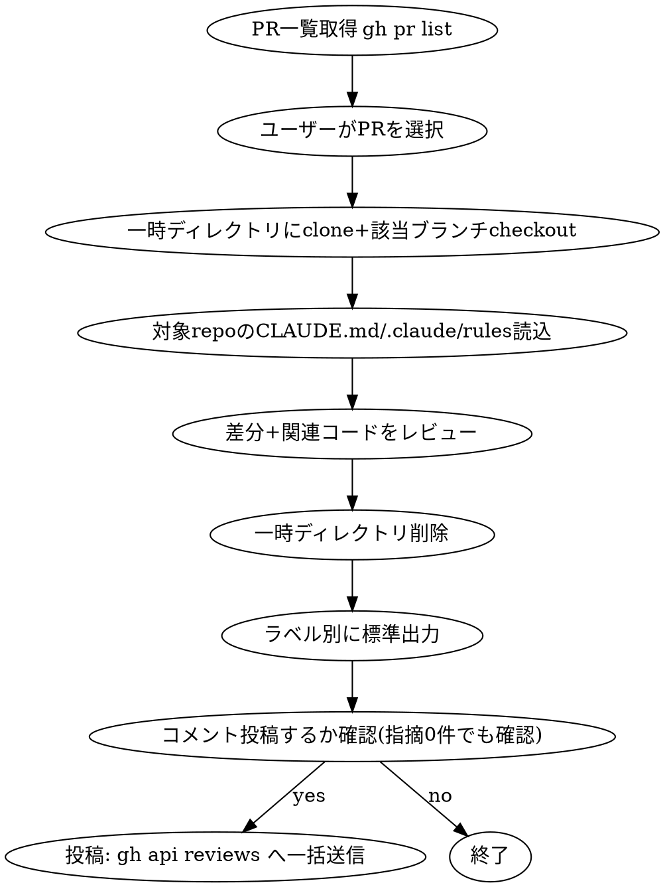

# GitHub PR Review

## Overview

`gh pr list` で選んだPRを、一時クローンした作業コピー上で関連コードも含めて深くレビューする。指摘は MUST / IMO / NITS / ASK のラベル付きで標準出力し、ユーザー確認後のみ該当差分箇所へインラインコメントとして投稿する。

## When to Use

- 「PRをレビューして」「プルリク一覧から選んでレビューして」等の依頼
- 対象は基本カレントディレクトリのgitリポジトリ。ユーザーが別リポジトリ（owner/repo）を明示した場合はそちらを使う
- 差分だけでなく、呼び出し元・呼び出し先など関連コードの文脈を踏まえたレビューが必要な場合

## Prerequisites

- `gh auth status` で認証済みであること。未認証なら案内して中断する
- 対象リポジトリに `git` でアクセス可能なこと（clone権限）

## Workflow



### 1. リポジトリとPRの特定

- リポジトリ未指定 → カレントディレクトリの `git remote get-url origin` から `owner/repo` を解決
- 明示指定あり → その `owner/repo` を使う
- `gh pr list --repo <owner>/<repo> --state open --json number,title,author,headRefName,updatedAt` で一覧取得し、AskUserQuestionで1件選ばせる（該当PRが多い場合は直近更新順に絞って提示）

### 2. 一時領域へのclone

```bash
TMPDIR_PR=$(mktemp -d)
git clone --quiet "https://github.com/<owner>/<repo>.git" "$TMPDIR_PR"
cd "$TMPDIR_PR"
git fetch --quiet origin "pull/<number>/head:pr-review-tmp"
git checkout --quiet pr-review-tmp
```

- shallow cloneにしない（関連コード探索のため履歴・全ファイルが必要）
- 元のカレントディレクトリのリポジトリには一切手を加えない（checkoutやbranch作成禁止）

### 3. レビュー基準の読込

`$TMPDIR_PR` 内の `CLAUDE.md` と `.claude/rules/*.md` を読み、存在すればそれを優先基準にする。存在しない場合は一般的な観点（バグ・セキュリティ・設計・パフォーマンス・可読性）でレビューする。

### 4. レビュー実施

- `gh pr diff <number> --repo <owner>/<repo>` で差分取得
- 差分だけで判断せず、`$TMPDIR_PR` 内で呼び出し元・呼び出し先・型定義・テストなど関連コードを実際に読んで文脈込みで判断する
- 各指摘は以下を持たせる: `file`（リポジトリルートからの相対パス）, `line`（新ファイル側の行番号）, `label`（MUST/IMO/NITS/ASK）, `summary`（指摘内容）, `reason`（理由）, `suggestion`（修正案）

#### ラベルの基準

ラベルは深刻度ではなく「マージ前に対応が必要か（ブロッキングか）」で決める。

| ラベル | 意味 | 該当例 |
|---|---|---|
| `MUST` | マージ前の対応が必須（ブロッキング） | セキュリティ脆弱性、データ破損、本番障害に直結する不具合、既存機能の破壊、重大な設計違反、プロジェクト規約への明確な違反 |
| `IMO` | 自分ならこうする（任意・非ブロッキング） | 保守性低下、エッジケース漏れ、パフォーマンス懸念、より良い設計の提案 |
| `NITS` | 些細な指摘（任意・非ブロッキング） | 命名、コメント、軽微なスタイル、タイポ |
| `ASK` | 質問・意図の確認（非ブロッキング） | 実装意図が読み取れない、仕様判断が必要、前提を確認したい |

判断に迷う場合は下げる（MUSTかIMOで迷う → IMO）。MUSTを乱発するとブロッキングの意味が薄れる。

#### 1指摘あたりの書き方

- **1コメント1指摘**にする。複数の論点を1コメントへ詰め込まない
- **理由を書く**。「なぜ問題なのか」を失敗シナリオ（どの入力・状態で何が壊れるか）または規約の該当箇所で示す
- **修正案を添える**。「〜が問題」で終わらせず、具体的な直し方まで書く（`ASK` は質問のみで可）

### 5. 後片付け

レビューに必要な情報（差分・該当コード抜粋）を確認し終えたら、標準出力へまとめる**前に**一時ディレクトリを削除する。

```bash
rm -rf "$TMPDIR_PR"
```

### 6. 標準出力

冒頭にサマリー（マージ可否の判断＋ラベル別件数）を出し、続けて `MUST → IMO → NITS → ASK` の順にグルーピングして出力する。1指摘1エントリ、file:lineを明記。

**マージ可否の判断:**

- `MUST` が0件 → `LGTM` とする（`ASK` が残っていてもLGTMとする。質問は回答待ちだがマージは止めない）
- `MUST` が1件以上 → `要修正` とし、マージ前の対応を促す

```
LGTM — MUST 0件 / IMO 2件 / NITS 1件 / ASK 1件

## IMO
- src/api/UserController.php:118 — 入力値の型検証がなく、不正な型が渡るとサービス層で型エラーになる。FormRequestでのバリデーションを追加。

## NITS
- src/api/UserController.php:12 — 未使用のimport。削除。

## ASK
- src/api/UserController.php:64 — リトライ回数を3固定にした意図は何か。設定値へ切り出す想定はあるか。
```

```
要修正 — MUST 1件 / IMO 0件 / NITS 0件 / ASK 0件

## MUST
- src/auth/session.php:42 — セッショントークンの有効期限チェックが `<` になっており、有効期限とまったく同時刻のリクエストが認証を通過する。`<=` に修正。
```

指摘が0件のラベルは見出しごと省略する。全体が0件なら `LGTM — 指摘なし` とだけ出力する。

### 7. コメント投稿確認

**GitHubへ書き込む前に、必ずAskUserQuestionでユーザーの承認を得る。** 承認なしに投稿しない。

- 指摘が1件以上ある場合 → 「GitHubのPRに指摘をコメントするか」を確認する
- 指摘が0件（LGTM）の場合 → 「LGTMコメントを投稿するか」を確認する。承認時はインラインコメント無しで、サマリーコメント（`LGTM — 指摘なし`）のみ投稿する

いずれも「いいえ」なら標準出力の結果のみで終了する。

### 8. コメント投稿（承諾時のみ）

`pulls/{pull_number}/reviews` APIへ1回のリクエストで全指摘をまとめて送る。各指摘は個別の `comments` 要素として渡すため、該当差分箇所ごとに独立したインラインコメントになる（1つのコメントにまとめない）。

```bash
HEAD_SHA=$(gh pr view <number> --repo <owner>/<repo> --json headRefOid -q .headRefOid)

gh api \
  --method POST \
  "repos/<owner>/<repo>/pulls/<number>/reviews" \
  -f commit_id="$HEAD_SHA" \
  -f event="COMMENT" \
  -f body="AIレビュー結果（Claude Code）: 要修正 — MUST 1件 / IMO 0件 / NITS 0件 / ASK 0件" \
  -F "comments[][path]=src/auth/session.php" \
  -F "comments[][line]=42" \
  -F "comments[][side]=RIGHT" \
  -F "comments[][body]=[MUST] セッショントークンの有効期限チェックが \`<\` になっており、有効期限とまったく同時刻のリクエストが認証を通過する。\`<=\` に修正。"
  # 指摘の数だけ comments[][...] を繰り返す
```

指摘0件（LGTM）で投稿を承認された場合は、`comments[][...]` を付けずサマリーのみ送る。

```bash
gh api \
  --method POST \
  "repos/<owner>/<repo>/pulls/<number>/reviews" \
  -f commit_id="$HEAD_SHA" \
  -f event="COMMENT" \
  -f body="AIレビュー結果（Claude Code）: LGTM — 指摘なし"
```

- レビュー種別は常に `COMMENT` を使う。`APPROVE` は自分のPRへ付けられないため、LGTMの判断は `body` に書く
- `body`（サマリーコメント）には「マージ可否の判断 + ラベル別件数」を必ず書く。`MUST` 0件なら `LGTM`、1件以上なら `要修正` とし、`要修正` の場合はマージ前の対応が必要である旨を1行添える
- 各インラインコメントの `body` はラベル（`[MUST]` / `[IMO]` / `[NITS]` / `[ASK]`）を先頭に付け、指摘内容 + 理由 + 修正案を書く
- 対象行が差分に含まれない行（コンテキスト行の外）の場合、GitHub APIはエラーを返す。その場合は該当ファイルの直近の差分行にフォールバックし、その旨を指摘本文に明記する

## Common Mistakes

- 一時ディレクトリを消す前に必要な情報を読み切っていない → 標準出力後に「もう一度確認したい」となり再clone発生。手順4で読み切ってから削除する
- `pull/<number>/head` ではなく `pull/<number>/merge` をfetchしてしまう → マージ後の状態を見てしまいレビューがズレる。必ず `head` を使う
- ユーザーの承認を得ずにGitHubへ投稿する → 投稿は必ず承認後。指摘0件（LGTM）の場合も確認する
- レビュー確認を1回のAskUserQuestionにまとめず、指摘ごとに逐一確認しない（全体で1回の投稿可否確認のみでよい）
- コメント投稿を `pulls/comments` への逐次POSTで行うと`commit_id`不整合が起きやすい。`pulls/reviews` への一括POSTを使う
- ラベルを深刻度で選んでしまう → 基準は「マージ前に対応が必要か」。深刻度の細かさはラベルではなく本文（失敗シナリオ）で表現する
- `MUST` を乱発する → ブロッキングの意味が薄れる。迷ったら `IMO` へ下げる
- 1つのコメントへ複数の指摘をまとめる → 1コメント1指摘にする
- 指摘内容だけ書いて理由・修正案を省く → 3点セット（内容・理由・修正案）で書く（`ASK` を除く）
