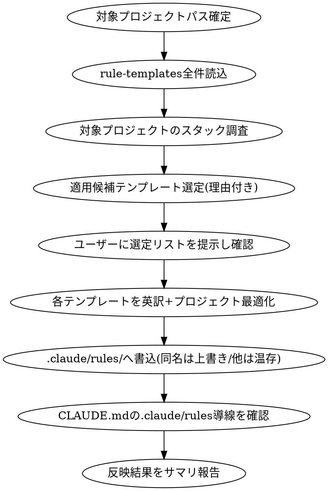

# Rule Template Sync

`~/dotfiles/.claude/rule-templates/*.md`（日本語で書かれた汎用ルール原本）を元に、対象プロジェクトの `.claude/rules/` へ、スタックに合わせて選定・英訳最適化した状態で配置する。

## Overview

- テンプレート原本は日本語・汎用的な内容。コピー先の `.claude/rules/*.md` は英語で書く（Claude Codeのシステムプロンプトに乗るため、トークン効率を優先する慣習）
- 単純コピーはしない。対象プロジェクトの実際のスタック・構成に合わせて内容を取捨選択し、英訳しながら最適化する
- 既存の `.claude/rules/` 配下にある「テンプレート由来ではない」独自ルールファイルは削除しない
- テンプレートと同名のファイルが既に存在する場合は上書きする

## When to Use

- 新規/既存プロジェクトに dotfiles のルールテンプレートを反映したいとき
- 「rule-templatesが更新されたので各プロジェクトに同期して」等、再同期のとき

## Workflow



### 1. 対象プロジェクトパスを確定する

依頼に対象プロジェクトが明記されていなければ確認する。

### 2. テンプレート一覧を読み込む

`~/dotfiles/.claude/rule-templates/*.md` を全件読み込む（現状: architecture, bug-fixing, coding-style, database, docker, git, github-actions, javascript, naming-romaji, php, python, security, testing, ui-development）。

### 3. 対象プロジェクトのスタックを調査する

主なシグナル:

| シグナル | 対象テンプレート |
|---|---|
| `package.json` | javascript.md |
| `composer.json` | php.md |
| `requirements.txt` / `pyproject.toml` | python.md |
| `Dockerfile` / `docker-compose*.yml` | docker.md |
| `.github/workflows/*.yml` | github-actions.md |
| DBマイグレーション/ORMスキーマ/`.env`のDB接続設定 | database.md |
| フロントエンドUIコンポーネント（React/Vue等）の存在 | ui-development.md |
| 日本語ドメインの命名規則を使っている形跡（変数名にローマ字日本語等） | naming-romaji.md |

以下は原則スタック非依存で常に候補に入れる: `coding-style.md`, `git.md`, `security.md`, `testing.md`, `bug-fixing.md`, `architecture.md`。

### 4. 選定リストをユーザーに提示し確認する

「このプロジェクトには javascript.md, coding-style.md, git.md, testing.md, security.md を適用予定です。よろしいですか？」の形式で、選定理由を添えて確認する。ユーザーの追加・除外指示があれば反映する。

### 5. 英訳しつつプロジェクト向けに最適化する

単純直訳のコピーはしない。各テンプレートについて:

- 日本語→英語に翻訳する
- 対象プロジェクトで使われていない言語・フレームワークの記述は削る（例: javascript.md中にPHP例が混在していれば削除）
- 対象プロジェクトの実際の規約（既存コード・既存CLAUDE.md・既存.claude/rules）と矛盾する記述があれば、実態に合わせて調整する
- frontmatter（`description`, `alwaysApply`等）は保持する。`description`も英訳する

### 6. `.claude/rules/` へ書き込む

- ファイル名はテンプレートと同じにする（例: `coding-style.md`）
- 既に同名ファイルが存在する場合は上書きする
- テンプレート由来ではない既存ファイル（対象プロジェクト固有のルール）は一切変更・削除しない

### 7. CLAUDE.mdの `.claude/rules/` 導線を確認する

Claude Codeが自動読込するのはCLAUDE.md（起動時システムプロンプト）のみで、`.claude/rules/*.md` はCLAUDE.md側に導線がないと認識されない。対象プロジェクトのCLAUDE.md（無ければAGENTS.md等の実体ファイル）を確認する。

- 既に `.claude/rules/` への言及がある場合 → 何もしない（既存の導線を尊重し、書式を変更しない）
- 言及がない場合 → 以下の1行相当を追記してよいかユーザーに確認した上で追記する

```markdown
### コーディング規約

- `.claude/rules/` 配下のルールに従う
```

- 追記位置は「コーディング規約」「Working Style」等の既存セクションがあればその直下、無ければファイル末尾に新規セクションとして追加する
- CLAUDE.mdがシンボリックリンク（例: `AGENTS.md -> CLAUDE.md`）の場合は実体ファイルを編集する
- 依頼された範囲外の他セクションは変更しない

### 8. サマリ報告

作成/上書きしたファイル一覧、見送ったテンプレート（理由付き）、CLAUDE.mdへの導線追記有無を簡潔に報告する。

## Notes

- テンプレート原本（`~/dotfiles/.claude/rule-templates/`）自体は編集しない。書き込み先は常に対象プロジェクトの `.claude/rules/`
- 対象プロジェクトが `~/projects/isystk-biz-ops` のようなドキュメント主体プロジェクトの場合、javascript/php/python等の言語系テンプレートは通常不要（プロジェクト内の実コードを確認して判断する）
